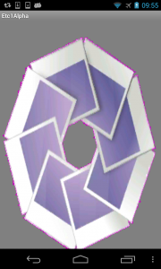
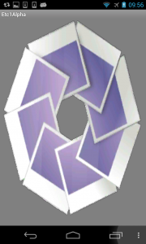

So …. supporting compressed textures on android is a right pain. There are a number of different graphics chips in play and they all support different texture compression formats, not very helpful. The only common format that is supported by all devices is the ETC1 format (ETC2 is GLES 3.0 only), the problem with this format is it doesn't support an alpha channel. Most game developers out there will know that the alpha channel is kinda important for games. So how can we make use of ETC1 and get a alpha channel at the same time?

There are a number of different methods that I've found on the net mostly have to do with storing the alpha channel separately and combining them in the fragment shader, [this](http://malideveloper.arm.com/develop-for-mali/sample-code/etcv1-texture-compression-and-alpha-channels/) article seems to contain the most accepted solutions. But personally I hate the idea of having to have two textures or mess about with texture coordinates to sample the data from different parts. If only there was another way… well lets turn back the clock a bit an use a technique we used to use before such a thing as an alpha channel even existed.

I'm talking about using a ColorKey, this is where you define a single colour in your image as the transparent colour, its used allot in movies these days for green screen work. We used to use this technique allot back in the day when video hardware didn't event know what an alpha channel was, so you just skip over the bits of the image that match the colour key and hey presto , you get a transparent image :).

So lets take a look at this image. 


it has a nice alpha channel. But if we replace the alpha with a constant colour like so


we can then re-write our fragment shader to just detect this colour and set the alpha channel explicitly without having to mess about with other bitmaps, or changing texture coordinates. So our fragment shader simply becomes

```glsl
uniform lowp sampler2D u_Texture;
varying mediump vec2 v_TexCoordinate;

void main()
{
  vec4 colorkey = vec4(1.0,0.0,0.96470588,0.0);
  float cutoff = 0.2;
  vec4 colour = texture2D(u_Texture, v_TexCoordinate);
  if ((abs(colour.r - colorkey.r) <= cutoff) &&
      (abs(colour.g - colorkey.g) <= cutoff) &&
      (abs(colour.b - colorkey.b) <= cutoff)) {
       colour.a = 0.0;
  }
  gl_FragColor = colour;
}

```

In this case I hardcoded the colour I'm using for the ColorKey but this could easily be passed in as a uniform if you wanted the flexibility of being able to change it.

With this in place we can now use ETC1 textures across all android devices and get a alpha channel. While its not a full alpha channel (with semi transparency) it will probably be enough for most games. You can generate your compressed textures using the 'etc1util' tool provided with the android sdk. Its located in the tools folder of the sdk and you can just call

```bash
etc1tool  _infile_ -encode -o _outfile_
```

you can then include the resulting _outfile_ in your Assets folder and set its build action to 'AndroidAsset' then use the following code to load the texture

```csharp
static int LoadTextureFromAssets (Activity activity, string filename)
{

  using (var s = activity.Assets.Open (filename)) {
    using (var t = Android.Opengl.ETC1Util.CreateTexture (s)) {
      int tid = GL.GenTexture ();
      GL.ActiveTexture (All.Texture0);
      GL.BindTexture (All.Texture2D, tid);
      // setup texture parameters
      GL.TexParameter (All.Texture2D, All.TextureMagFilter, (int)All.Linear);
      GL.TexParameter (All.Texture2D, All.TextureMinFilter, (int)All.Nearest);
      GL.TexParameter (All.Texture2D, All.TextureWrapS, (int)All.ClampToEdge);
      GL.TexParameter (All.Texture2D, All.TextureWrapT, (int)All.ClampToEdge);
      Android.Opengl.ETC1Util.LoadTexture ((int)All.Texture2D, 0, 0, (int)All.Rgb, (int)All.UnsignedShort565, t);
      return tid;
    }
  }
}
```

Note you'll need to add using clauses for the various OpenTK namespaces used in the code.

Now there is a problem with this technique, because of the way ETC1 works you will more than likely get some compression artefacts on the resulting image. In this my case I ended up with a purple/pink line around the image I was rendering. So perhaps that colour isn't the best choice in this case.



So I tried again this time with a black colour key. This might help reduce the compression artifacts around the edges of the image. But I had to make some changes to the shader to make it a bit more generic and to handle a black colour key. The resulting shader turned out to be as follows.

```glsl
uniform lowp sampler2D u_Texture;
varying mediump vec2 v_TexCoordinate;

void main()
{
  float cutoff = 0.28;
  vec4 colour = texture2D(u_Texture, v_TexCoordinate);
  if ((colour.r <= cutoff) &&
      (colour.g <= cutoff) &&
      (colour.b <= cutoff)) {
       colour.a = colour.r;
  }
  gl_FragColor = colour;
}

```

You can see we are just using a rgb cutoff value to detect the black in the image and turn that into a transparency. Note that I'm using the red channel to set the transparent colour rather than just using 0.0, hopefully this will help with the blending. This produced the following result.



There is a slight black edge around the image, but it is probably be something you can get away with. The only issue with this is you can't use black in your image :( or if you do it has to be above the colour cutoff in the shader, that will require some testing to see what values you can get away with.

Well hopefully this will be useful for someone. Next time around I'll be going into how to support texture compression formats like PVRTC, ATITC and S3TC on your android devices. These formats should cover most of the devices out there (but not all) and support a full alpha channel, but if you are after full compatibility then ETC1 is probably the way to go.

In the mean time the code from this article is available on [github](https://github.com/infinitespace-studios/Blog/tree/master/Etc1Alpha).
