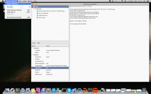

Its finally done, the Pipeline tool is now working on OSX (and Linux). Over the christmas break I worked with another MonoGame contributor (@cra0zy) to finish off the Tool and build the Mac OS Installer.

The app itself behaves like the one on Windows so we have a fairly consistent experience. The command line tool MGCB is bundled with the App so you can use the following as part of a build process

> mono /Applications/Pipeline.app/Contents/MonoBundle/MGCB.exe /@:SomeMGCBFile.mgcb

You can compile Textures, Fonts, 3D Models and Audio using this tool and the requirement to have XNA installed is totally gone. You can also use your own content processors and importers, exactly how you do that will be a topic of a future post :)

A few things to keep in mind.

- There might be a few issues with Audio/Song's atm, the MonoGame guys are looking to move over to using ffmpeg to get a better cross platform experience.
- Only the newer .fbx file format is supported. If you are trying to use older models from the original xna samples they will need to be upgraded first. This can be done using either the [Autodesk tools](http://www.autodesk.com/products/fbx/overview "http://www.autodesk.com/products/fbx/overview") or just by opening the .fbx in visual studio 2013+

There is however one thing missing completely,  Effect compilation. Because of dependencies on DirectX the 2MGFX tool cannot be ported to Mac (or Linux) at this time. There is a plan to implement a GLSL style version of the HLSL .fx format which will allow Mac and Linux (and Windows) developers to use GLSL in their shaders rather than HLSL. This will be designed to work cross platform from the outset. For now Effect files will need to be compiled on Windows.

Even with this functionality missing this is still an extremely useful tool, I would highly recommend anyone using MonoGame on a Mac to check it out.

\[caption id="attachment\_173" align="aligncenter" width="300"\] Pipeline Tool on OSX\[/caption\]

Don't forget, MonoGame is a community driven project. The community is extremely friendly and helpful, so don't be scared to join in.

Don't be just a consumer, '_go [fork](https://github.com/mono/MonoGame/fork) and contribute'._
