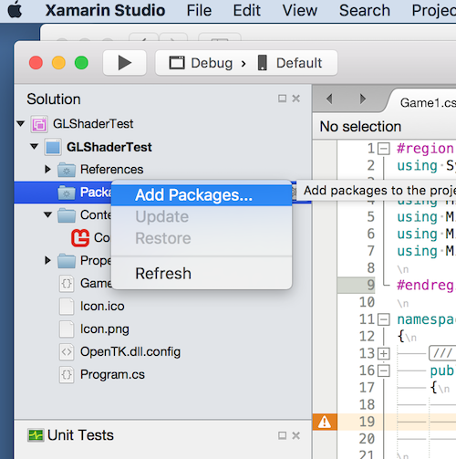
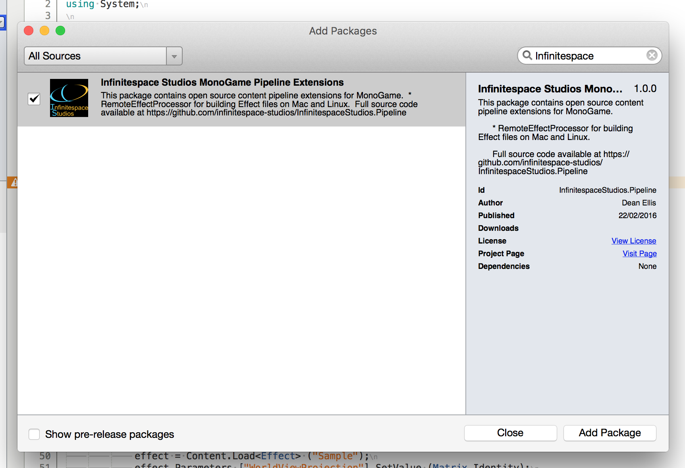
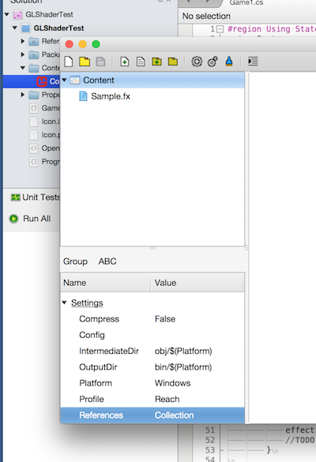
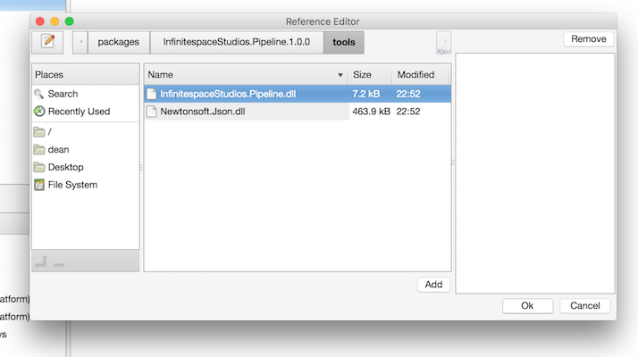
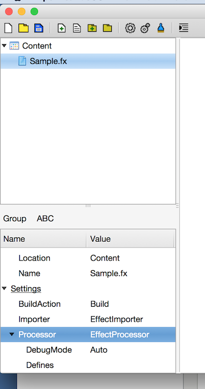
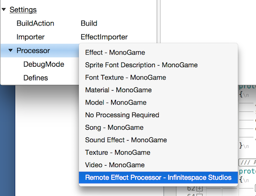
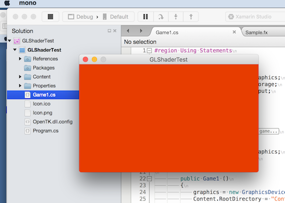

One of the issues MonoGame Mac (and Linux) developers face is not being able to build shaders. Getting a good shader HLSL compiler to work on a non Windows platform is tricky. Work is under way to get this done but it will take some time to get right.

That leaves Mac (and Linux) developers a bit stuck. Well there is a solution, a custom Content Pipeline processor. This is where the Content Pipeline can show its pure awesomeness.

### The Problem

Lets break it down, we have a shader we can to build. But we MUST build it on a Windows box. One way is to do it manually, but doing stuff manually is dull. Rather than opening a Virtual Machine and copying compiled .xnb files about, I wrote a pipeline extension. Its goal to take the shader code, send it to the Windows box. Compile it and send the result back to be packaged into an .xnb.

### The Solution

MonoGame has a tool called 2MGFX. This is the underlying tool which takes HLSL .fx files and compiles them to HLSL or GLSL. So what I did was create a service which just shells out to the tool and gets the compiled code (or errors). We then return the results and use the existing packaging process to produce the .xnb file or throw an error. Then I went one further. Hosted the server in [Azure](https://pipeline.infinitespace-studios.co.uk), which saves me having to boot my VM each time I want to compile a shader.

The resulting processor code for this is quite simple. The new class is derived from EffectProcessor. You will see that if we are running the processor on Windows we just fall back to the default EffectProcessor code. Which means you can use the same Processor on Mac and Windows.

One restriction at this time is that the .fx file needs to be self contained. In other words you cannot use include's or have code in external files. One this I could do is plug in the MonoGame Effect pre-processor to pull all of those includes into one file. But that is a job for the future (or a PR :) )

If you want to take a look at all the code you can find it [here](https://github.com/infinitespace-studios/InfinitespaceStudios.Pipeline).

### The Code

```csharp
public override CompiledEffectContent Process (EffectContent input, ContentProcessorContext context)
{
    if (Environment.OSVersion.Platform != PlatformID.Unix) {
        return base.Process (input, context);
    }
    var code = input.EffectCode;
    var platform = context.TargetPlatform;
    var client = new HttpClient ();
    client.BaseAddress = new Uri (string.Format ("{0}://{1}:{2}/", Protocol, RemoteAddress, RemotePort));
    var response = client.PostAsync ("api/Effect", new StringContent (JsonSerializer (new Data  () {
        Platform = platform.ToString(),
        Code = code
    }), Encoding.UTF8, "application/json")).Result;
    if (response.IsSuccessStatusCode) {
        string data = response.Content.ReadAsStringAsync ().Result;
        var result = JsonDeSerializer (data);
        if (!string.IsNullOrEmpty (result.Error)) {
            throw new Exception (result.Error);
        }
        if (result.Compiled == null || result.Compiled.Length == 0)
            throw new Exception ("There was an error compiling the effect");
        return new CompiledEffectContent (result.Compiled);
    } else {
        throw new Exception (response.StatusCode.ToString ());
    }
    return null;
}
```

Pretty simple code isn't it! At some point I'll see if we can replace the **_.Result_** code with **_async/await_**. But I'm not entirely sure how the Pipeline will respond to that.

### Using InfinitespaceStudios.Pipeline

Using this extension could not be easier.

If you want to use the _default_ service

1. Open your project and find the Packages Folder. Right click and select Add Packages. [](https://github.com/infinitespace-studios/InfinitespaceStudios.Pipeline/wiki/images/AddPackage.png)
2. This will open the Nuget search Dialog. Search for "InfinitespaceStudios.Pipeline" and add the Package.[](https://github.com/infinitespace-studios/InfinitespaceStudios.Pipeline/wiki/images/Add.png)
3. Once the package has been added. Open the Content.mgcb file in the Pipeline Editor.[](https://github.com/infinitespace-studios/InfinitespaceStudios.Pipeline/wiki/images/OpenContent.png)
4. Select the "Content" node and then find the References property in the property grid. Double click the References property to bring up the Add References Dialog.[](https://github.com/infinitespace-studios/InfinitespaceStudios.Pipeline/wiki/images/AddPipeline.png)
5. Search for the "InfinitespaceStudios.Pipeline.dll" and Add it by clicking on the "Add" button. Note this should be located in the "packages\\InfinitespaceStudios.Pipeline.X.X.X\\Tools" folder. Once that is done, Save the Content.mgcb. Close it an re open it (there is a bug in the Pipeline Tool). The select the .fx file you want to change. [](https://github.com/infinitespace-studios/InfinitespaceStudios.Pipeline/wiki/images/ChangeProcessor.png)
6. Select the Processor property and in the drop down you should see "Remote Effect Processor - Infinitespace Studios". Select this Item.[](https://github.com/infinitespace-studios/InfinitespaceStudios.Pipeline/wiki/images/RemoteEffect.png)
7. If you are using the defaults just Save the Content.mcgb. Close the Pipeline tool and Build and Run you app. It should compile without any issues. If there is a problem with the .fx file the error will be reported in the build log. [](https://github.com/infinitespace-studios/InfinitespaceStudios.Pipeline/wiki/images/BuildAndRun.png)

If you are using a Custom Azure site or the Local Service on a Windows box you can use the _RemoteAddress_ , _RemotePort_ and _Protocol_ properties to change the location of the server. Valid _Protocol_ values are "http" and "https" if you have a secured service. The _RemoteAddress_ can be a CNAME or IP address.

 

### Conclusion

Hopefully this post has shown you what a cool thing the Pipeline system is. One of my future posts will be about creating a pipeline extension from scratch. So if you are interested watch out for it. In the mean time, if you are a mac user. Get compiling those shaders!
