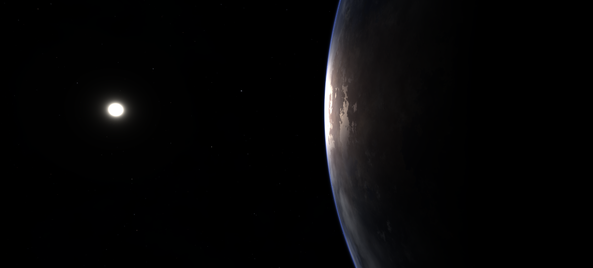

Want a seamless skybox for your MonoGame project without dealing with six cube-map textures? An equirectangular panorama mapped onto a sphere is a great option. In this post, I walk through a complete demo that renders a full-sphere skybox from a single panorama image using a custom HLSL shader. You can grab the full sample project from [GitHub](https://github.com/infinitespace-studios/Blog/tree/main/EquirectangularSkyboxDemo).



## What is a SkyBox?

A skybox is the background that surrounds the player in a 3D game. It gives the illusion of a distant environment such as stars, mountains, or clouds without modeling any of that geometry. The two most common approaches are:

1. **Cube Map**: Six separate textures (one per face of a cube) stitched together.
2. **Equirectangular Panorama**: A single 2:1 image that wraps around a sphere.

Cube maps are the traditional choice, but they require you to produce and manage six separate images that must line up perfectly at the seams. An equirectangular panorama is a single file, and it can be created in programs such as [Blender](https://blender.org), or sourced from sites like [spacespheremaps.com](https://www.spacespheremaps.com/).

## What is Equirectangular? Sounds Complicated?

Not really. An equirectangular projection is the same thing you see on a flat world map: longitude maps to the horizontal axis and latitude maps to the vertical axis. The image has a 2:1 aspect ratio. The left and right edges represent the same longitude (they wrap), the top row is the north pole, and the bottom row is the south pole.

The math to convert a 3D direction into a UV coordinate on this image is surprisingly simple:

```hlsl
float u = atan2(dir.z, dir.x) / (2.0 * PI) + 0.5;   // longitude → 0..1
float v = acos(dir.y) / PI;                         // latitude  → 0..1
```

That is it. Given any normalized direction from the camera, these two lines give you the texel to sample. No cube-face selection logic and no edge blending.

### Building a Sphere

The skybox is rendered on the inside of a unit sphere centered at the origin. In the sample, a `SphereMesh` class generates this procedurally with configurable longitudinal slices and latitudinal stacks. The default is 32 slices by 16 stacks, which gives a smooth enough sphere without too many triangles. You can also use an imported 3D model instead of generating one at runtime.

Only vertex positions are needed. No normals or texture coordinates are required because the shader derives the sampling direction directly from the vertex position.

```csharp
_sphere = new SphereMesh(graphicsDevice, slices: 32, stacks: 16);
```

The mesh is built with a top pole vertex, intermediate rings of vertices, and a bottom pole vertex. Indices are generated for a triangle-fan top cap, quad strips in the middle, and a triangle-fan bottom cap. I'm not going to go into the code at this point, it's all in the sample on [GitHub](https://github.com/infinitespace-studios/Blog/tree/main/EquirectangularSkyboxDemo).

### The HLSL Shader

The shader file `EquirectangularSkybox.fx` is intentionally minimal.
The snippets below cover the most complex parts. The rest of the `.fx` file is boilerplate.
The sample uses `Macros.fxh`, a header from MonoGame. It defines helper macros such as `SAMPLE_TEXTURE` that make it easier to write effects that work across MonoGame platforms.

```hlsl
// Vertex Shader
VSOutput MainVS(VSInput input)
{
    VSOutput output;
    output.Position = mul(input.Position, RotationProjection);
    // Push to far plane so skybox never occludes scene geometry
    output.Position.z = output.Position.w;
    // The view direction IS the sphere vertex position
    output.ViewDir = normalize(input.Position.xyz);
    return output;
}

// Pixel Shader
float4 MainPS(VSOutput input) : SV_Target0
{
    float3 dir = normalize(input.ViewDir);
    float u = atan2(dir.z, dir.x) / (2.0 * 3.14159265358979) + 0.5;
    float v = acos(dir.y) / 3.14159265358979;
    return SAMPLE_TEXTURE(SkyMap, float2(u, v));
}
```

The `RotationProjection` matrix is the rotation-only view matrix multiplied by the projection matrix. Translation is stripped on the C# side so the camera is always at the center of the sphere. You could zero this out in the shader, but that would waste instructions because it would run per vertex. It is better to do it once in C#.

The line `output.Position.z = output.Position.w` pushes every skybox pixel to the maximum depth value (1.0), so any scene geometry drawn afterward always renders in front of the sky.

In the pixel shader, the interpolated view direction is converted to equirectangular UVs and used to sample the panorama texture. This is the same two-line `atan2` and `acos` formula shown earlier.

### The Renderer

`EquirectangularSkyboxRenderer` ties everything together. Here is the rendering sequence.

```csharp
public void Draw(Matrix view, Matrix projection)
{
    // Disable depth writes: the sky is infinitely far away
    _gd.DepthStencilState = DepthStencilState.None;
    // Cull counter-clockwise: we're rendering from INSIDE the sphere
    _gd.RasterizerState = RasterizerState.CullCounterClockwise;

    // Strip translation from the view matrix
    Matrix rotationOnly = view;
    rotationOnly.M41 = 0f;
    rotationOnly.M42 = 0f;
    rotationOnly.M43 = 0f;
    rotationOnly.M44 = 1f;

    Matrix rotProj = rotationOnly * projection;

    _effect.Parameters["RotationProjection"].SetValue(rotProj);
    _effect.Parameters["SkyMap"].SetValue(SkyTexture);

    // Draw the sphere mesh
    _gd.SetVertexBuffer(_sphere.VertexBuffer);
    _gd.Indices = _sphere.IndexBuffer;
    foreach (EffectPass pass in _effect.CurrentTechnique.Passes)
    {
        pass.Apply();
        _gd.DrawIndexedPrimitives(PrimitiveType.TriangleList,
            baseVertex: 0, startIndex: 0,
            primitiveCount: _sphere.PrimitiveCount);
    }
}
```

The important bit here is stripping translation from the view matrix. By zeroing out `M41`, `M42`, and `M43`, the camera always sits at the center of the sphere, no matter how far the player moves in the world. The sky never shifts, which is exactly what you want.

We also set `DepthStencilState.None` so the skybox does not write to the depth buffer. It is infinitely far away, so it should not interfere with scene geometry. That way, everything drawn afterward passes the depth test and renders in front of the sky.

### The Camera

`QuaternionCamera` builds orientation from yaw and pitch floats using `Quaternion.CreateFromYawPitchRoll`. This avoids gimbal lock and gives smooth first-person mouselook. Each frame, mouse delta is accumulated, pitch is clamped to plus or minus 89 degrees, and WASD movement is applied along the camera's local forward and right vectors.

```csharp
// Clamp pitch to avoid flipping
float maxPitch = MathHelper.ToRadians(89f);
Pitch = MathHelper.Clamp(Pitch, -maxPitch, maxPitch);

Quaternion orientation = Quaternion.CreateFromYawPitchRoll(Yaw, Pitch, 0f);
Vector3 forward = Vector3.Transform(-Vector3.UnitZ, orientation);
Vector3 right   = Vector3.Transform( Vector3.UnitX, orientation);
```

### Putting It All Together

In `LoadContent`, load the effect and texture, then create an `EquirectangularSkyboxRenderer` instance.
To change the texture later, assign a new value to `_skybox.SkyTexture`.

```csharp
var skyEffect = Content.Load<Effect>("Effects/EquirectangularSkybox");

// --- Procedural equirectangular sky texture ---------------------
_skyTexture = Content.Load<Texture2D>("Textures/earthlike_planet_close");

// --- Skybox renderer --------------------------------------------
_skybox = new EquirectangularSkyboxRenderer(GraphicsDevice, skyEffect);
_skybox.SkyTexture = _skyTexture;
_skybox.ShowWireframe = false;
```

In `Game1.cs` the draw order is straightforward:

```csharp
protected override void Draw(GameTime gameTime)
{
    GraphicsDevice.Clear(Color.Black);

    // 1. Draw skybox FIRST
    _skybox.Draw(_camera.View, _camera.Projection);

    // 2. Draw scene geometry (it will always appear in front)

    base.Draw(gameTime);
}
```

### Using Your Own Panorama

The demo ships with HDR panorama textures, but you can easily swap in your own. Download a free equirectangular HDRI from [Poly Haven](https://polyhaven.com/hdris) or [NASA SVS](https://svs.gsfc.nasa.gov/4851), convert it to PNG or JPEG, add it to `Content/Textures/`, register it in `Content.mgcb`, and update the `Content.Load<Texture2D>` call in `LoadContent`:

```csharp
_skyTexture = Content.Load<Texture2D>("Textures/MyPanorama");
```

The texture sampler is configured to wrap horizontally and clamp vertically, which is the behavior needed for equirectangular mapping:

```csharp
private static readonly SamplerState SkyboxSampler = new SamplerState
{
    AddressU = TextureAddressMode.Wrap,   // longitude wraps
    AddressV = TextureAddressMode.Clamp,  // latitude clamps at poles
    Filter   = TextureFilter.Linear,
};
```

## Conclusion

An equirectangular skybox is simpler to set up than a traditional cube map and lets you use any panoramic photo or HDRI directly. The whole technique boils down to three steps: generate a sphere, strip translation from the view matrix, and use two lines of trig in the pixel shader to sample a 2:1 panorama. The full demo project is available on [GitHub](https://github.com/infinitespace-studios/Blog/tree/main/EquirectangularSkyboxDemo). Clone it, swap in your favorite panorama, and you are good to go.
