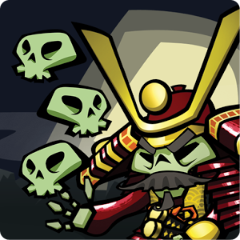
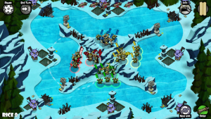
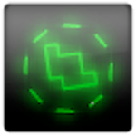
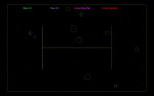
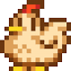
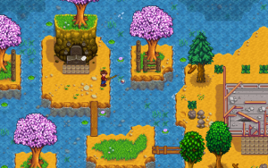

Here is information on all of the XNA to MonoGame ports that I have completed. If you have an old XNA game that you are interested in porting to MonoGame contact me via twitter [@infspacestudios](https://twitter.com/infspacestudios). I can work on the following platforms  iOS, Android, OUYA, Windows 10, Linux and MacOS. 

| Logo | Game  | Screenshot |
| -- | -- | -- |
|  |  **Skulls of the Shogun** Developer - [17 Bit](http://17-bit.com) Platforms - Android, OUYA Url : [http://skullsoftheshogun.com](http://skullsoftheshogun.com) |  |
|  |  **Vector Rumble** Developer - Microsoft Platforms -  - [Mac Store](https://itunes.apple.com/gb/app/vector-rumble/id1142799488?mt=12) - [Itch.io (Mac, Linux, Windows)](https://infinitespace-studios.itch.io/vector-rumble) |  |
|  |  **Stardew Valley** Developer - ConcernedApe Platforms - Steam (Mac/Linux) Url : [http://stardewvalley.net](http://stardewvalley.net) |  |

